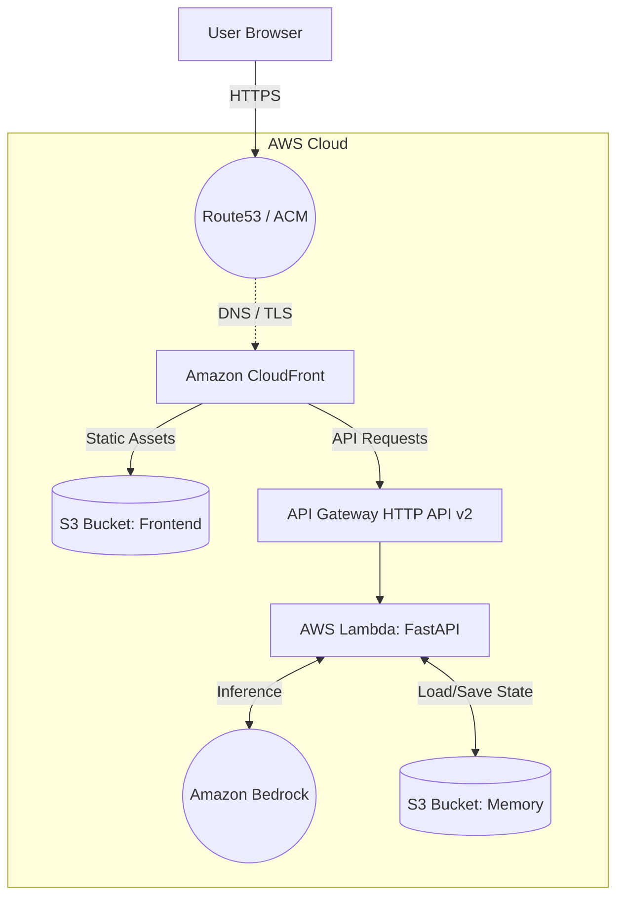
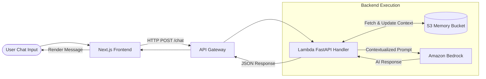
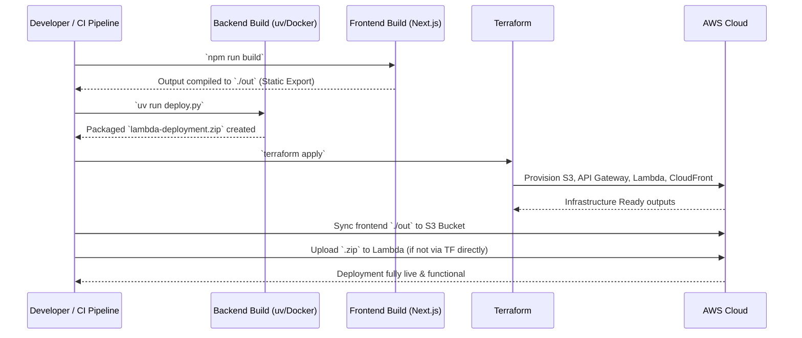
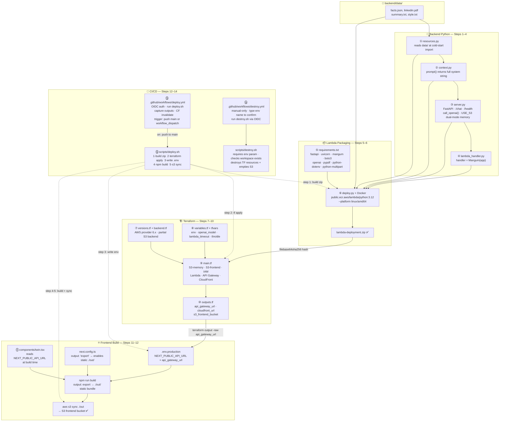

# Digital Twin

This project is a Digital Twin application—a personalized AI assistant modeled to answer questions and interact based on specific provided context. Built as part of the "AI in MLOps" course (Week 2, Day 5) by Ed Donner, it utilizes a modern serverless cloud architecture on AWS to provide a highly scalable, low-latency chatbot experience powered by Amazon Bedrock.

## 🚀 Tech Stack

**Frontend:**
- **Framework:** Next.js 15 (App Router, Static Export)
- **Language:** TypeScript
- **Hosting:** Amazon S3 + CloudFront

**Backend:**
- **Framework:** FastAPI (wrapped with Mangum for AWS Lambda compatibility)
- **Language:** Python 3.12
- **Environment:** AWS Lambda + API Gateway (HTTP API v2)
- **AI / LLM:** Amazon Bedrock (`us.amazon.nova-lite-v1:0`)
- **Memory Storage:** Amazon S3 (for conversation history)
- **Packaging:** Docker (`public.ecr.aws/lambda/python:3.12`), `uv`

**Infrastructure & Deployment:**
- **IaC:** Terraform
- **CI/CD Configuration:** GitHub Actions + AWS OIDC Authentication
- **Networking:** Route53, AWS Certificate Manager (ACM)

---

## 🏗️ Architecture Diagram

The system follows a completely serverless architecture using AWS managed services. 

---

## 🔄 Data Flow Diagram

When a user interacts with the Digital Twin, the data flows across the stack to enrich the prompt with historical context before inference:

---

## ⚙️ Build & Deployment Sequence

The project handles build processes for both the frontend (Node.js) and the backend (Python application packaged via `uv` and Docker), before deploying infrastructure via Terraform.

---

## 🧩 Build Dependencies

The following flowchart maps out how the different components (Backend, Lambda packaging, Terraform, Frontend, and CI/CD) relate to each other and trigger deployments.

---

## 🛠️ Testing & Development
- **Backend Deployment Script:** `backend/deploy.py` packages the backend for Lambda.
- **Full Deploy Script:** `scripts/deploy.sh` wraps the complete build, sync, and Terraform apply processes.
